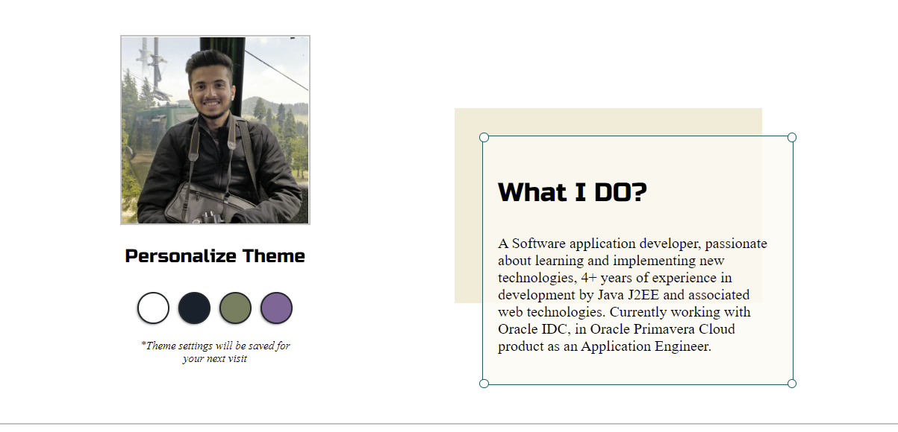

### Hi there 👋

I'm a software application developer, passionate about learning and implementing new technologies, 4+ years of experience in development by Java J2EE and associated web technologies. Currently working with Oracle IDC, in Oracle Primavera Cloud product as an Application Engineer who is passionate about making contributing to open-source more approachable, creating technology to elevate people, and building community. Some technologies I enjoy working with include ReactJS, Jamstack (JavaScript, APIs + Markup) and GraphQL. 

Find me around the web 🌎:http://dineshkini.com/

Tinkering with interactions on Codepen 🏓: https://codepen.io/dikini

Sharing updates on LinkedIn 💼: https://www.linkedin.com/in/dikini/

